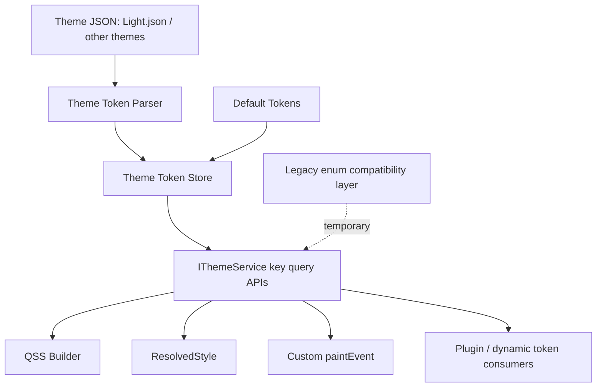

# Matcha 主题与 Token 模块整改方案

## 1. 最新决策基线

本方案围绕 Matcha 的 Qt 主题模块、`NyanTheme`、Token 解析与消费链路展开，不覆盖 Application、Workbench 等框架层内容。

当前已确认的关键决策如下：

| 决策项 | 结论 | 影响 |
|---|---|---|
| `Light.json` 定位 | 消费级 Token 定义文件 | C++ 层应围绕 JSON key 建立运行时 Token 存储和查询接口 |
| schema 校验 | 当前阶段不做旧 schema 校验 | 不允许旧 `tokens_schema.json` 阻塞新版 `Light.json` 加载 |
| `ThemeMode` | 不再作为主题切换依据 | 主题身份只来自注册主题配置文件中的 `name` |
| 主题注册 | 只传入 JSON 文件路径 | `RegisterTheme(jsonPath)` 从根字段 `name` 读取主题名 |
| `extends` | 阶段一不保留 | 不做主题继承和递归叠加 |
| 旧枚举 API | 仅作为主题模块整改期临时兼容层 | 主题模块整改完成后删除 `ColorToken/SpaceToken/FontRole` 等旧枚举消费 API |
| 新消费方式 | 以字符串 key / Token 查询接口为主 | 新控件和新测试不再继续扩展旧枚举 |

## 2. 文档偏差修正

结合最新计划，原文档存在以下偏差，已在本文中修正：

| 偏差 | 原问题 | 修正方式 |
|---|---|---|
| 旧枚举定位不准确 | 原文表述为“同时支持强类型 API 和字符串 key”，容易理解为长期并存 | 改为“旧枚举仅临时兼容，阶段整改完成后删除” |
| 阶段二目标过宽 | 原阶段二同时补查询接口、保留枚举桥接、提升消费便捷性 | 阶段二聚焦新 Token 查询接口，旧枚举只做迁移保护，不作为新增能力 |
| 文档结构重复 | 阶段一表格和说明出现重复段落 | 重新整理阶段一和阶段二结构 |
| Token 权威源不清晰 | 原文仍保留多处以 C++ 枚举为中心的描述 | 改为 `Light.json` / 主题 JSON 是权威输入，C++ 负责解析、缓存、查询、Qt 适配 |
| 测试方向不明确 | 原文没有明确测试应迁移到新 key 查询 | 阶段二新增主题测试整改任务，要求以新版 Token key 为主 |
| CMake 支撑不足 | 原文没有覆盖主题专用构建目标 | 阶段二新增主题相关 CMake 目标拆分任务 |

## 3. 整改目标

| 编号 | 目标 | 验收标准 |
|---|---|---|
| G1 | 以新版主题 JSON 作为 Token 权威输入 | 新增、修改、删除 Token 时优先修改 JSON，不需要同步扩展旧枚举 |
| G2 | 让新版 `Light.json` 可安全加载 | 缺失字段保留默认值并记录日志，不再出现生产路径调试 fallback 色 |
| G3 | 建立字符串 key 查询接口 | 控件、插件、测试可以通过 `Color("colorPrimary")` 等方式消费 Token |
| G4 | 正确表达复杂 Token | 渐变、阴影不再被强行塞进 `QColor` 或单层阴影结构 |
| G5 | 移除 `ThemeMode` 依赖 | 注册、切换、动态 Token 选择均不依赖 Light/Dark 枚举 |
| G6 | 建立主题模块专用验证链路 | 可以只编译和运行主题模块相关单元测试 |
| G7 | 完成旧枚举 API 退场 | 主题模块整改完成后删除旧 `ColorToken/SpaceToken/FontRole` 等 API |

## 4. 总体技术路线

推荐按四层演进：

| 层级 | 职责 | 主要产物 |
|---|---|---|
| Token 文件层 | 保存消费级 Token 原始定义 | `Light.json`、后续其他主题 JSON |
| Token 解析层 | 将 JSON 转成运行时类型 | `ApplyColorTokens()`、`ApplyFontTokens()`、后续 `ThemeTokenParser` |
| Token 存储层 | 提供默认值、覆盖、索引、查询 | `ThemeTokenStore` 或 `NyanTheme` 内部临时 store |
| Qt 适配层 | 转成 `QColor`、`QBrush`、`QFont`、QSS、控件样式 | `NyanTheme`、`IThemeService`、`ResolvedStyle` |

核心原则：

- 新版主题 JSON 是权威输入。
- 字符串 key 查询是新消费主线。
- 旧枚举 API 是迁移期兼容层，禁止继续作为新能力扩展点。
- 渐变、阴影、字体、尺寸应有各自类型或 store，不应混入颜色数组。
- schema 校验后置，先稳定运行时消费模型。

## 5. 阶段一：让新版 `Light.json` 可被安全加载

### 5.1 目标

在不做旧 schema 校验的前提下，`NyanTheme` 能安全读取新版 `Light.json`，未支持的 Token 不再静默忽略，缺失值不再落入调试色。

### 5.2 任务拆分

| 任务 ID | 任务名称 | 目标 | 主要修改点 | 输入 | 输出 | 前置依赖 | 完成判定 |
|---|---|---|---|---|---|---|---|
| S1-T1 | 收缩 `LoadPalette()` 职责 | 让 `LoadPalette()` 只负责打开 JSON、解析根对象和字段分发 | `NyanTheme.cpp`、`NyanTheme.h` | 现有 `LoadPalette()` | 入口清晰的总控函数 | 无 | `LoadPalette()` 内不再包含大段具体解析代码 |
| S1-T2 | 调整主题注册签名 | 注册只依赖文件路径和 JSON 根字段 `name` | `IThemeService.h`、`NyanTheme.h`、`NyanTheme.cpp` | 主题 JSON 文件路径 | 主题名与文件路径映射 | S1-T1 可并行 | `RegisterTheme(jsonPath)` 可用 |
| S1-T3 | 增加 `name` 强校验 | 确保运行时主题标识可信 | `NyanTheme.cpp` | 已解析根对象 | 稳定主题标识 | S1-T2 | `name` 缺失、为空、不一致时注册或加载失败 |
| S1-T4 | 建立默认 Token 初始化 | 让 JSON 覆盖建立在稳定默认值之上 | `NyanTheme.cpp`、`DefaultPalette.h` | 默认颜色、尺寸、字体、阴影 | `InitializeDefaultTokens()` | S1-T1 | 不加载 JSON 时仍有可用 Token |
| S1-T5 | 拆分颜色解析 | 区分普通颜色和渐变 | `NyanTheme.cpp`、`NyanTheme.h` | `root["colors"]` | 单色缓存 + 渐变缓存 | S1-T4 | 渐变不进入 `QColor::fromString()` |
| S1-T6 | 建立尺寸类 Token 存储 | 让尺寸类 Token 进入运行时系统 | `NyanTheme.h`、`NyanTheme.cpp` | `space/radius/lineWidth/iconSize/controlHeight/containerWidth` | dimension map | S1-T4 | `spaceXXS`、`radiusDefault`、`controlHeightMD` 可进入缓存 |
| S1-T7 | 拆分字体解析 | 让新版字体 Token 进入运行时存储 | `NyanTheme.h`、`NyanTheme.cpp` | `root["fonts"]` | font map | S1-T4 | `fontXS/fontSM/fontMS/fontMD/fontLG` 可进入缓存 |
| S1-T8 | 拆分阴影解析 | 读入并缓存多层阴影 | `NyanTheme.h`、`NyanTheme.cpp` | `root["shadows"]` | shadow map | S1-T4 | `shadowSM/shadowMS/shadowMD` 可进入缓存 |
| S1-T9 | 清理调试 fallback 色 | 用默认值 + 日志替代调试色 | `NyanTheme.cpp` | 文件或字段异常 | 稳定错误处理 | S1-T4~S1-T8 | 异常时不污染界面颜色 |
| S1-T10 | 阶段一回归验证 | 验证新版 `Light.json` 可安全加载 | 主题加载链路、测试 | `Light.json` | 阶段一验收记录 | S1-T1~S1-T9 | 满足阶段一验收标准 |

### 5.3 阶段一当前收口提醒

进入阶段二前必须确认：

- `SetTheme()` 不能只加载 JSON 后立即发信号，应恢复必要的字体、阴影、样式表、组件覆盖和全局 QSS 构建链路。
- `_currentTheme` 应在注册校验通过后再更新，避免切换失败却污染当前主题状态。
- `DynamicColor()` 当前不能固定返回 `lightValue`，需要在阶段二或阶段五按新模型整改。
- 编译排障期间临时加入的旧枚举兼容别名不能被视为长期方案。

## 6. 阶段二：补齐 Token 查询接口，提升消费便捷性

### 6.1 目标

阶段二的目标不是继续扩展旧枚举 API，而是建立面向新版主题 JSON 的统一 Token 查询接口。控件、插件、QSS 构建和测试应能通过新版 Token key 直接查询颜色、尺寸、字体、渐变和阴影。

旧 `ColorToken/SpaceToken/FontRole/ShadowToken/AnimationsToken` 等枚举接口只作为迁移期兼容层。阶段二可以保留它们以降低一次性迁移风险，但不能继续围绕旧枚举新增能力；主题模块整改完成后应删除。

### 6.2 涉及文件

| 文件 | 调整方向 |
|---|---|
| `Matcha/Include/Matcha/Theming/IThemeService.h` | 增加字符串 key 查询接口和复杂 Token 返回类型 |
| `Matcha/Include/Matcha/Theming/NyanTheme.h` | 暴露查询实现，整理内部 store 字段 |
| `Matcha/Source/Theming/NyanTheme.cpp` | 实现颜色、尺寸、字体、渐变、阴影查询 |
| `Matcha/Include/Matcha/Theming/ResolvedStyle.h` | 为后续 key 驱动样式和复杂 Token 预留字段 |
| `Matcha/Include/Matcha/Theming/WidgetStyleSheet.h` | 后续从枚举引用迁移到 Token key 引用 |
| `Matcha/CMakeLists.txt` | 增加主题专用测试目标 |
| `Matcha/Tests/Unit/Theming/*` | 按新版 Token 模型重写主题模块测试 |

### 6.3 推荐接口方向

阶段二推荐先提供清晰、低风险、可测试的查询接口：

```cpp
enum class TokenKind {
  Color,
  Gradient,
  Font,
  Dimension,
  Shadow,
};

struct GradientStop {
  double position = 0.0;
  QColor color;
};

struct GradientSpec {
  std::vector<GradientStop> stops;
};

struct ShadowLayerSpec {
  int offsetX = 0;
  int offsetY = 0;
  int blurRadius = 0;
  int spread = 0;
  QColor color;
};

[[nodiscard]] virtual auto Color(std::string_view key) const -> std::optional<QColor> = 0;
[[nodiscard]] virtual auto Gradient(std::string_view key) const -> std::optional<GradientSpec> = 0;
[[nodiscard]] virtual auto DimensionPx(std::string_view key) const -> std::optional<int> = 0;
[[nodiscard]] virtual auto Font(std::string_view key) const -> std::optional<FontSpec> = 0;
[[nodiscard]] virtual auto Shadow(std::string_view key) const -> std::optional<std::span<const ShadowLayerSpec>> = 0;
[[nodiscard]] virtual auto HasToken(TokenKind kind, std::string_view key) const -> bool = 0;
```

说明：

- `DimensionPx()` 阶段二先统一承接 `space/radius/lineWidth/iconSize/controlHeight/containerWidth`。
- 渐变可以先从 `A|B` 字符串解析为最小 `GradientSpec`，不要求立即支持完整结构化渐变 JSON。
- 阴影可返回只读视图或复制值，具体形式按现有生命周期和 ABI 风险决定。
- 旧枚举接口保留期间应内部映射到新 key 或默认值，但不得新增旧枚举项来承接新 Token。

### 6.4 阶段二开发计划表

| 任务 ID | 任务名称 | 目标 | 主要修改点 | 输入 | 输出 | 前置依赖 | 完成判定 |
|---|---|---|---|---|---|---|---|
| S2-T1 | 明确 Token 查询接口边界 | 固化阶段二新增 API 和旧 API 迁移边界 | `IThemeService.h`、`NyanTheme.h` | 阶段一 store | 查询接口定义 | S1-T10 | 文档和头文件明确旧枚举仅临时兼容 |
| S2-T2 | 增加颜色 key 查询 | 支持按 JSON key 查询单色 | `NyanTheme.cpp` | `_colorTokensByKey`、默认色 | `Color("colorPrimary")` | S2-T1 | 存在返回 `QColor`，不存在返回 `std::nullopt` |
| S2-T3 | 增加尺寸 key 查询 | 支持所有尺寸类 Token 统一查询 | `NyanTheme.cpp` | `_dimensionTokensByKey` | `DimensionPx("spaceXXS")` | S2-T1 | 尺寸类 key 可查，非法 key 返回空 |
| S2-T4 | 增加字体 key 查询 | 支持新版字体 Token 查询 | `NyanTheme.cpp` | `_fontTokensByKey` | `Font("fontSM")` | S2-T1 | 字体查询返回完整 `FontSpec` |
| S2-T5 | 增加渐变查询 | 把阶段一渐变缓存升级为可消费结构 | `IThemeService.h`、`NyanTheme.cpp` | `_gradientTokensByKey` | `Gradient("colorPrimaryGradient")` | S2-T1、S2-T2 | `A|B` 可解析为两个 stop |
| S2-T6 | 增加阴影 key 查询 | 支持多层阴影查询 | `IThemeService.h`、`NyanTheme.cpp` | `_shadowTokensByKey` | `Shadow("shadowSM")` | S2-T1 | 返回多层阴影结构 |
| S2-T7 | 增加 `HasToken()` | 提供统一存在性检查 | `IThemeService.h`、`NyanTheme.cpp` | 各 Token store | `HasToken(kind, key)` | S2-T2~S2-T6 | 所有 Token 类型可被检查 |
| S2-T8 | 梳理旧枚举兼容映射 | 保证迁移期旧 API 可用但不扩展 | `NyanTheme.cpp`、Token 头文件 | 旧枚举调用点 | 集中映射表或兼容函数 | S2-T2~S2-T4 | 旧 API 不再依赖分散硬编码表 |
| S2-T9 | 清理阶段二无用变量和函数 | 删除或隔离与新查询链路冲突的废弃实现 | `NyanTheme.cpp`、`NyanTheme.h` | 旧表、旧注释、无用字段 | 更干净的主题实现 | S2-T8 | 无未使用函数、无误导性旧路径 |
| S2-T10 | 增加主题专用 CMake 目标 | 允许只编译主题模块和主题测试 | `CMakeLists.txt` | Theming 源码和测试 | `MatchaThemeTests` 或等价目标 | S2-T1 | 可独立构建主题相关测试目标 |
| S2-T11 | 重写主题单元测试 | 以新版 key 查询为主建立测试集 | `Tests/Unit/Theming/*` | `Light.json`、fixture | 新主题测试 | S2-T2~S2-T7 | 测试不再以旧枚举扩展为主 |
| S2-T12 | 阶段二回归验证 | 验证查询接口、兼容层和主题专用构建目标 | 构建脚本、测试目标 | 阶段二代码 | 验收记录 | S2-T1~S2-T11 | 主题目标通过，完整构建风险清单明确 |

### 6.5 阶段二建议执行顺序

| 顺序 | 任务 ID | 原因 |
|---|---|---|
| 1 | S2-T1 | 先锁定接口边界，避免旧枚举继续扩散 |
| 2 | S2-T2 | 颜色是最核心、最常用 Token |
| 3 | S2-T3 | 尺寸类 Token 对控件开发影响最大 |
| 4 | S2-T4 | 字体查询支撑 QSS 和基础控件 |
| 5 | S2-T5 | 渐变需要独立返回类型，不能继续混在颜色接口中 |
| 6 | S2-T6 | 阴影先支持查询，再逐步接入控件渲染 |
| 7 | S2-T7 | 统一存在性检查依赖各 store 查询稳定 |
| 8 | S2-T8 | 旧枚举兼容映射应在新查询可用后再整理 |
| 9 | S2-T9 | 清理应在主要查询链路稳定后执行，避免误删迁移依赖 |
| 10 | S2-T10 | CMake 目标在测试重写前建立，减少验证成本 |
| 11 | S2-T11 | 测试应基于稳定接口重写 |
| 12 | S2-T12 | 作为阶段二结束门禁 |

### 6.6 阶段二任务拆分说明

#### S2-T1 明确 Token 查询接口边界

阶段二必须先统一接口边界。新增接口应面向新版 JSON key，不应继续扩大旧枚举体系。

必须明确：

- 新代码优先使用字符串 key 查询。
- 旧枚举 API 标记为迁移期兼容。
- 旧枚举 API 不新增 Token 项。
- 主题模块整改完成后删除旧枚举 API 和兼容映射。

#### S2-T2 增加颜色 key 查询

新增 `Color(std::string_view key)`。查询只访问单色 store，不处理渐变。

规则：

- key 存在且颜色有效，返回 `QColor`。
- key 不存在，返回 `std::nullopt`。
- 不在查询函数里生成调试色。
- 查询失败是否打印日志应谨慎，避免高频控件绘制刷屏；建议只提供调试诊断接口或低频日志。

#### S2-T3 增加尺寸 key 查询

新增 `DimensionPx(std::string_view key)`，统一查询：

- `space*`
- `radius*`
- `lineWidth*`
- `iconSize*`
- `controlHeight*`
- `containerWidth*`

阶段二先返回整数像素值。密度缩放是否在 `DimensionPx()` 内完成需要明确：建议原始 Token 查询返回基础值，控件解析或 `Resolve()` 阶段再做密度缩放，避免同一个 key 在不同语境下重复缩放。

#### S2-T4 增加字体 key 查询

新增 `Font(std::string_view key)`。返回 `FontSpec`。

规则：

- 平台字体 family fallback 可由 `BuildFonts()` 或初始化流程补齐。
- JSON 中缺失 family 时使用平台默认字体。
- JSON 中缺失 size/weight 时使用默认 Token。
- `fontXS/fontSM/fontMS/fontMD/fontLG` 是阶段二最小必测集合。

#### S2-T5 增加渐变查询

新增 `Gradient(std::string_view key)`。阶段二处理阶段一缓存的原始字符串。

最小解析规则：

- `#A|#B` 表示线性渐变。
- 第一个 stop 位置为 `0.0`。
- 第二个 stop 位置为 `1.0`。
- 任一颜色无效则返回 `std::nullopt`，保留诊断信息。

阶段二不要求立即实现 `Brush()`，但接口设计应避免后续无法扩展到 `QBrush` 或 QSS `qlineargradient(...)`。

#### S2-T6 增加阴影 key 查询

新增 `Shadow(std::string_view key)`。返回多层阴影。

规则：

- 阴影查询不再降级为单层 `ShadowSpec`。
- Qt Widgets 暂不支持多层渲染的控件，可以后续在消费层降级。
- 阶段二重点是“查得到完整结构”，不是“所有控件立即渲染一致”。

#### S2-T7 增加 `HasToken()`

`HasToken(TokenKind kind, std::string_view key)` 用于测试、诊断和控件可选能力判断。

它不应触发 fallback，也不应修改状态。

#### S2-T8 梳理旧枚举兼容映射

兼容层只为旧控件过渡存在。

处理方式：

- 旧 `Color(ColorToken)` 尽量映射到新颜色 key。
- 旧 `SpacingPx(SpaceToken)`、`Radius(RadiusToken)` 可映射到新 dimension key 或保留固定默认值。
- 旧 `Font(FontRole)` 可映射到 `fontXS/fontSM/fontMS/fontMD/fontLG`。
- 所有映射集中维护，禁止散落在控件中。

阶段二结束时应输出旧 API 删除清单，为后续删除做准备。

#### S2-T9 清理阶段二无用变量和函数

清理范围包括：

- 不再使用的旧 token name table。
- 被大段注释掉的历史逻辑。
- 临时调试 fallback。
- 与新 store 重复的旧字段。
- 编译排障期间加入但不符合最终路线的临时兼容项。

清理前必须确认测试覆盖，否则容易误删仍被旧控件间接依赖的逻辑。

#### S2-T10 增加主题专用 CMake 目标

目标是降低主题模块验证成本。

推荐新增：

- `MatchaThemeTests`：只包含主题相关单元测试。
- 必要时新增内部 object library 或静态库承接 Theming 源码。

注意：不能为了“只编译主题”破坏主 `Matcha` target。主题专用目标应是辅助验证目标，完整构建仍保留。

#### S2-T11 重写主题单元测试

测试应以新版 Token key 为主。

推荐测试集：

| 测试主题 | 覆盖内容 |
|---|---|
| 主题注册 | `RegisterTheme(jsonPath)`、`name` 缺失、空值、错误值 |
| 主题加载 | `Light.json` 可加载，不依赖旧 schema |
| 颜色查询 | `Color("colorPrimary")`、非法 key |
| 渐变查询 | `Gradient("colorPrimaryGradient")`、非法渐变 |
| 尺寸查询 | `DimensionPx("spaceXXS")`、`DimensionPx("controlHeightMD")` |
| 字体查询 | `Font("fontSM")`、缺失字段 fallback |
| 阴影查询 | `Shadow("shadowSM")` 多层结构 |
| 兼容层 | 旧 API 在迁移期仍可用，但不作为新增能力 |
| 错误处理 | 缺失字段保留默认值，不产生调试色 |

#### S2-T12 阶段二回归验证

阶段二完成判定：

- 新字符串 key 查询接口可用。
- 渐变和阴影有独立查询模型。
- 旧枚举 API 的迁移边界明确。
- 主题专用测试目标可构建。
- 新主题测试覆盖新版 `Light.json` 的关键 Token。
- 没有把旧枚举兼容层误写成长期架构。

## 7. 后续阶段概览

| 阶段 | 名称 | 目标 |
|---|---|---|
| 阶段三 | 重建字体 Token 模型 | 让 `fontXS/fontSM/fontMS/fontMD/fontLG` 成为真实字体消费主线 |
| 阶段四 | 渐变 Token 独立建模 | 提供 `GradientSpec`、后续 `QBrush` / QSS 适配 |
| 阶段五 | 移除 `ThemeMode` 残余模型 | 动态 Token、主题切换和调色板策略不再依赖 Light/Dark |
| 阶段六 | 阴影与复杂效果 Token 化 | 完整消费多层阴影并定义降级策略 |
| 阶段七 | 重构 QSS 与控件样式消费 | 控件样式从枚举硬编码迁移到 Token key / Resolver |
| 阶段八 | 删除旧枚举 API | 删除临时兼容层和旧枚举消费入口 |

## 8. 总体验收清单

### 8.1 加载与切换

- `Light.json` 不经旧 schema 也能被加载。
- 主题注册以 JSON 根字段 `name` 为准。
- `SetTheme(name)` 不依赖 `ThemeMode`。
- 切换主题后颜色、字体、尺寸、阴影缓存全部刷新。

### 8.2 Token 查询

- `Color("colorPrimary")` 返回有效 `QColor`。
- `Gradient("colorPrimaryGradient")` 返回有效 `GradientSpec`。
- `DimensionPx("spaceSM")` 返回 12。
- `DimensionPx("radiusDefault")` 返回 3。
- `DimensionPx("controlHeightMD")` 返回 32。
- `Font("fontSM")` 返回有效 `FontSpec`。
- `Shadow("shadowSM")` 返回多层阴影。

### 8.3 测试与构建

- 主题专用构建目标可单独构建。
- 主题单元测试以新版 Token key 为主。
- 旧枚举测试只覆盖迁移期兼容，不再作为新增能力验收标准。
- 完整构建失败时能区分主题模块问题和非主题模块问题。

### 8.4 旧 API 退场

- 旧枚举 API 有明确删除清单。
- 新控件开发不得继续引入旧枚举 Token 依赖。
- 主题模块整改完成后删除旧兼容层。

## 9. 风险与处理策略

| 风险 | 表现 | 处理 |
|---|---|---|
| 旧枚举和新 key 并存导致混乱 | 开发不知道该用哪个入口 | 明确新代码只用新 key，旧枚举只迁移期兼容 |
| 字符串 key 降低类型安全 | 拼写错误运行时才发现 | 增加集中常量、`HasToken()`、测试和后续 validator |
| 渐变接入 QSS 与自绘差异大 | 同一 Token 渲染不一致 | 先统一 `GradientSpec`，再由适配层生成 `QBrush` 或 QSS |
| 多层阴影 Qt Widgets 支持有限 | 无法完整还原设计效果 | 先完整解析和查询，消费层定义降级策略 |
| CMake 主题目标拆分过深 | 破坏主库构建关系 | 主题目标作为辅助测试目标，不替代完整构建 |
| 一次性删除旧 API 风险大 | 大量旧控件和测试编译失败 | 先集中兼容映射，阶段八统一删除 |

## 10. 最终目标架构



最终状态下：

- 主题 JSON 是 Token 权威输入。
- `NyanTheme` 是 Qt 适配器，不再承载大量硬编码 Token 生成逻辑。
- 新消费入口以字符串 key / Resolver 为主。
- 渐变和阴影拥有独立模型。
- 主题身份完全来自配置文件 `name`。
- 旧枚举 API 在迁移完成后删除。
